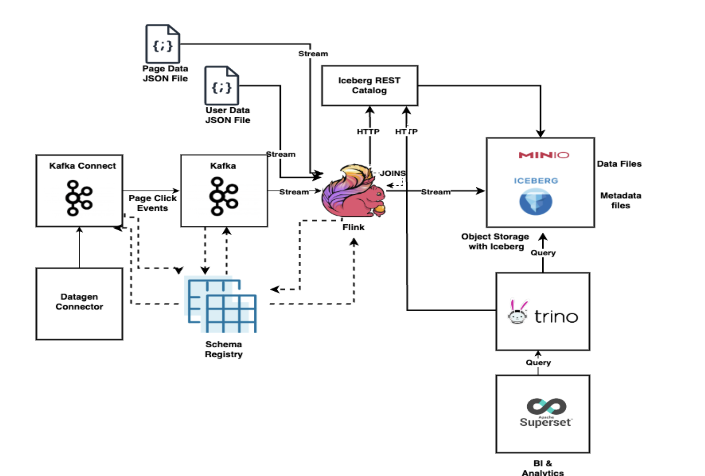

# Demo code for my Kafka Flink meetup talk on "Streaming Lakehouse with Kafka, Flink and Iceberg"

This repository has the demo code for building a real time analytics dashboard by ingesting data to Kafka, process it using Apache Flink and storing it using Iceberg storage and querying it through Trino and visualising it through Apache Superset

## Demo Outline



The demo setup is based on docker compose with Kafka, Flink, Kafka Connect with Datagen connector, Schema Registry, Trino, Rest catalog, Superset, Minio. We will ingest page click event messages to Kafka using the Datagen Connector. We will stream this data in Flink along with some user details and page details data JSON files from file system using Flink SQL and store in Iceberg. Further we will write some Flink SQL code to perform joins and store the results as well in Iceberg. We will then configure Trino to read these data and visualise them using Apache Superset.  The idea is to show how data flows from Kafka to Iceberg using Flink and how you can connect other query engines like Trino to read this data and visualise using Superset.

Sample Page Click Event message

```

{
  "viewtime": 1,
  "userid": "User_7",
  "pageid": "Page_81"
}


```

The users.json file which maps userid to region will be ingested from file system which and can be referred here [users.json](/input/users/users.json)

The pages.json file which maps pageid to pagedescription will be ingested from file system and can be referred here [pages.json](/input/pages/pages.json)

## Demo Pre-Requisites

The demo is based on [docker-compose](https://docs.docker.com/compose/) environment

Docker compose setup will have the following containers 

- Kafka Broker (KRAFT based)
- Confluent Schema Registry
- Kafa Connect with Dotagen Connector plugins
- AKHQ (to visualise messages in Kafka topics)
- Flink Job Manager
- Flink Task Manager
- Flink SQL Shell Client
- Minio (S3 compatible object storage)
- Minio Client (To initialize root directory in Minio storage)
- Iceberg Rest Catalog (Iceberg Catalog)
- Trino (Query engine to query iceberg)
- Superset (To visualise data from iceberg)

We also have a Dockerfile for the containers for Flink Job Manager, Task Manager, SQL Shell client to initialise some connectors. Also for Trino for some iceberg rest catalog configuration and superset for some initialization. The input directory which contains the Json files users.json and pages.json is mounted as a volume to use from Flink

## Download and bring up the containers and start simulator

1) Make sure Docker Daemon is running
2) Checkout this repo. 
3) cd to the directory
4) Download Hadoop 3.3.4 from https://hadoop.apache.org/release/3.3.4.html and keep the hadoop-3.3.4 directory inside this checked out directory (after un-tar)
5) Build the required docker images 
 ```
    docker compose build --pull sql-client
    docker compose build --pull jobmanager
    docker compose build --pull trino
    docker compose build --pull superset 

 ```
6) Bring up the containers using the command ``` docker-compose up -d ```
7) Perform ``` docker ps ``` and make sure there are 12 containers up and running for the demo
8) Create Datagen connector using below curl script from command line or equivalent one through postman to simulate page click events 

```
curl --location --request PUT 'http://localhost:8083/connectors/datagen_local_01/config' \
--header 'Content-Type: application/json' \
--data '{
            "connector.class": "io.confluent.kafka.connect.datagen.DatagenConnector",
            "key.converter": "org.apache.kafka.connect.storage.StringConverter",
            "kafka.topic": "pageviews",
            "quickstart": "pageviews",
            "max.interval": 500,
            "iterations": 10000,
            "tasks.max": "1"
}'

```
9) Verify if the events are being written to the pageviews Kafka topic through AKHQ http://localhost:8085/ui/docker-kafka-server/topic/pageviews/data?sort=Oldest&partition=All
10) Launch Flink SQL shell by using docker exec command below

```
docker exec -it sql-client ./sql-client.sh

```

11) Set properties in Flink SQL session to query results in table format, to set checkpoint interval, to set streaming mode

```

SET sql-client.execution.result-mode=tableau;

SET 'execution.checkpointing.interval' = '10sec';

SET execution.runtime-mode = streaming;

```
12) Create page_views table in Flink from the Kafka events from pageviews topic. This will use Kafka Flink connector along with appropriate properties including schemaregistry url

```
CREATE TABLE page_views (
        viewtime BIGINT,
        userid STRING,
        pageid STRING
    ) WITH (
        'connector' = 'kafka',
        'topic' = 'pageviews',
        'scan.startup.mode' = 'earliest-offset',
        'properties.bootstrap.servers' = 'broker:29092',
        'value.format' = 'avro-confluent',
        'value.avro-confluent.schema-registry.url' = 'http://schemaregistry:8084'
    );

```
13) Create users table in Flink from JSON message in file system. This will use filesystem Flink connector with appropriate properties

CREATE TABLE
users (
userid STRING,
region STRING

    ) WITH (
    'connector' = 'filesystem',
	'path' = 'file:/opt/flink/input/users',
	'format'='json',
	'json.fail-on-missing-field' = 'false',
	'json.map-null-key-mode' = 'DROP',
        'source.monitor-interval' = '100'
);
  
14) Create pages table in Flink from JSON message in file system. This will use filesystem Flink connector with appropriate properties

CREATE TABLE
pages (
pageid STRING,
pagedescription STRING

    ) WITH (
    'connector' = 'filesystem',
	'path' = 'file:/opt/flink/input/pages',
	'format'='json',
	'json.fail-on-missing-field' = 'false',
	'json.map-null-key-mode' = 'DROP',
        'source.monitor-interval' = '100'
);


