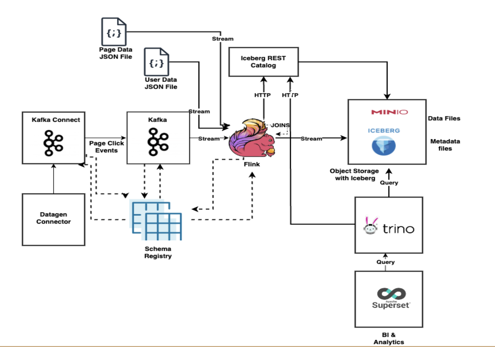

# Demo code for my Kafka Flink meetup talk on "Streaming Lakehouse with Kafka, Flink and Iceberg"

This repository has the demo code for building a real time analytics dashboard by ingesting data to Kafka, process it using Apache Flink and storing it using Iceberg storage and querying it through Trino and visualising it through Apache Superset

## Demo Outline



The demo setup is based on docker compose with Kafka, Flink, Kafka Connect with Datagen connector, Schema Registry, Trino, Rest catalog, Superset, Minio. We will ingest page click event messages to Kafka using the Datagen Connector. We will stream this data in Flink along with some user details and page details data JSON files from file system using Flink SQL and store in Iceberg. Further we will write some Flink SQL code to perform joins and store the results as well in Iceberg. We will then configure Trino to read these data and visualise them using Apache Superset.  The idea is to show how data flows from Kafka to Iceberg using Flink and how you can connect other query engines like Trino to read this data and visualise using Superset.

Sample Page Click Event message

```

{
  "viewtime": 1,
  "userid": "User_7",
  "pageid": "Page_81"
}


```

The users.json file which maps userid to region will be ingested from file system which and can be referred here [users.json](/input/users/users.json)

The pages.json file which maps pageid to pagedescription will be ingested from file system and can be referred here [pages.json](/input/pages/pages.json)

## Demo Pre-Requisites

The demo is based on [docker-compose](https://docs.docker.com/compose/) environment

Docker compose setup will have the following containers 

- Kafka Broker (KRAFT based)
- Confluent Schema Registry
- Kafa Connect with Dotagen Connector plugins
- AKHQ (to visualise messages in Kafka topics)
- Flink Job Manager
- Flink Task Manager
- Flink SQL Shell Client
- Minio (S3 compatible object storage)
- Minio Client (To initialize root directory in Minio storage)
- Iceberg Rest Catalog (Iceberg Catalog)
- Trino (Query engine to query iceberg)
- Superset (To visualise data from iceberg)

We also have a Dockerfile for the containers for Flink Job Manager, Task Manager, SQL Shell client to initialise some connectors. Also for Trino for some iceberg rest catalog configuration and superset for some initialization. The input directory which contains the Json files users.json and pages.json is mounted as a volume to use from Flink

## Download and bring up the containers and start simulator

1) Make sure Docker Daemon is running
2) Checkout this repo. 
3) cd to the directory
4) Download Hadoop 3.3.4 from https://hadoop.apache.org/release/3.3.4.html and keep the hadoop-3.3.4 directory inside this checked out directory (after un-tar)
5) Build the required docker images 
 ```
    docker compose build --pull sql-client
    docker compose build --pull jobmanager
    docker compose build --pull trino
    docker compose build --pull superset 

 ```
6) Bring up the containers using the command ``` docker-compose up -d ```


7) Perform ``` docker ps ``` and make sure there are 12 containers up and running for the demo
8) Create Datagen connector using below curl script from command line or equivalent one through postman to simulate page click events 

```
curl --location --request PUT 'http://localhost:8083/connectors/datagen_local_01/config' \
--header 'Content-Type: application/json' \
--data '{
            "connector.class": "io.confluent.kafka.connect.datagen.DatagenConnector",
            "key.converter": "org.apache.kafka.connect.storage.StringConverter",
            "kafka.topic": "pageviews",
            "quickstart": "pageviews",
            "max.interval": 500,
            "iterations": 10000,
            "tasks.max": "1"
}'

```
9) Verify if the events are being written to the pageviews Kafka topic through [AKHQ](http://localhost:8085/ui/docker-kafka-server/topic/pageviews/data?sort=Oldest&partition=All) 
10) Launch Flink SQL shell by using docker exec command below

```
docker exec -it sql-client ./sql-client.sh

```

11) Set properties in Flink SQL session to query results in table format, to set checkpoint interval, to set streaming mode

```

SET sql-client.execution.result-mode=tableau;

SET 'execution.checkpointing.interval' = '10sec';

SET execution.runtime-mode = streaming;

```
12) Create page_views table in Flink from the Kafka events from pageviews topic. This will use Kafka Flink connector along with appropriate properties including schemaregistry url

```
CREATE TABLE page_views (
        viewtime BIGINT,
        userid STRING,
        pageid STRING
    ) WITH (
        'connector' = 'kafka',
        'topic' = 'pageviews',
        'scan.startup.mode' = 'earliest-offset',
        'properties.bootstrap.servers' = 'broker:29092',
        'value.format' = 'avro-confluent',
        'value.avro-confluent.schema-registry.url' = 'http://schemaregistry:8084'
    );

```
13) Create users table in Flink from JSON message in file system. This will use filesystem Flink connector with appropriate properties

CREATE TABLE
users (
userid STRING,
region STRING

    ) WITH (
    'connector' = 'filesystem',
	'path' = 'file:/opt/flink/input/users',
	'format'='json',
	'json.fail-on-missing-field' = 'false',
	'json.map-null-key-mode' = 'DROP',
        'source.monitor-interval' = '100'
);
  
14) Create pages table in Flink from JSON message in file system. This will use filesystem Flink connector with appropriate properties

CREATE TABLE
pages (
pageid STRING,
pagedescription STRING

    ) WITH (
    'connector' = 'filesystem',
	'path' = 'file:/opt/flink/input/pages',
	'format'='json',
	'json.fail-on-missing-field' = 'false',
	'json.map-null-key-mode' = 'DROP',
        'source.monitor-interval' = '100'
);


15) So far we have created 3 tables corresponding to 1 Kafka topic and 2 file system sources. All these are created in Flink's default catalog and default database. You can verify the tables created and the current catalog and 
current database as shown in the screenshot below

 

16) Query the tables created to see the data. To terminate the streaming results mode , use ctrl + c


```
select * from page_views;

select * from users;
 
select * from pages;


```

17) Now let's create a dedicated Flink catalog for the Flink tables we will be creating with iceberg connector. By creating this catalog, we need not repeat all the iceberg connector and iceberg catalog information in each create table statement.

```


  CREATE CATALOG ice_catalog WITH (
    'type'='iceberg',
    'catalog-impl'='org.apache.iceberg.rest.RESTCatalog',
    'io-impl'='org.apache.iceberg.aws.s3.S3FileIO',
    'uri'='http://iceberg-rest:8181',
    'warehouse'='s3://warehouse/',
    'property-version'='1',
    's3.endpoint'='http://minio:9000',	
    's3.path-style-access'='true',
    's3.access-key-id'='admin',
    's3.secret-access-key'='password'
  );

```

18) Let's switch to this new catalog created and create a new database under it

```
use catalog ice_catalog;

CREATE DATABASE ice_db
  WITH (
    'db'='ice_db'
  );


  

```

19) Let's again switch back to the Flink default catalog as we will have to create iceberg tables from from the tables we created earlier in the default catalog 

```

use catalog default_catalog;

```

20) Create new iceberg table "ice_page_views" from the existing "page_views" table. The table name is prefixed with "ice_catalog.ice_db" as we want to create this table in the Flink iceberg catalog and db we had created earlier with all the properties related to iceberg. As you can see we are not again supplying all the iceberg related properties as it will be inherited from the Flink iceberg catalog

```

CREATE TABLE ice_catalog.ice_db.ice_page_views
    AS
    SELECT * FROM page_views;

```


21) You can verify the Flink job from the [Flink Dashboard](http://localhost:8081/#/job/running) 


 

22) Also check the Minio object storage from browser that the iceberg data and metadata files are being created for the above table. The user name and password to use are admin/password [Minio Storage](http://localhost:9001/browser/warehouse). You can drill down and check the different metadata files and the data files being created. 


23) Proceed to create the remaining 2 raw iceberg tables namely ice_users and ice_pages from the corresponding tables in Flink's default catalog we created earlier

```


CREATE TABLE ice_catalog.ice_db.ice_users
    AS
    SELECT * FROM users;

```

```
CREATE TABLE ice_catalog.ice_db.ice_pages
    AS
    SELECT * FROM pages;

```

24) Now let's create a new table to hold the results of joining 3 tables from Flink's default catalog. So this needs a create table statement followed by an insert statement which selects and joins data from the3 3 tables as follows.

```
CREATE TABLE ice_catalog.ice_db.ice_user_page_views(
userid string,
pageid string,
region string,
pagedescription string
);

```

```

insert into ice_catalog.ice_db.ice_user_page_views select u.userid, pv.pageid, u.region, p.pagedescription from users u join page_views pv on(u.userid = pv.userid) join pages p on(pv.pageid = p.pageid);


```


25) Execute select statement on this table to check results. By default the query will terminate after showing existing data, for showing results
in streaming mode to wait for new data, use the streaming options as shown in the 2nd statement below


```

select * from ice_catalog.ice_db.ice_user_page_views;

```

```
SELECT * FROM ice_catalog.ice_db.ice_user_page_views /*+ OPTIONS('streaming'='true', 'monitor-interval'='1s') */;

```

26) Now let's switch to Flink iceberg_catalog and perform some queries to check the list of snapshots created, the different manifest files, 
different branches and tags (only main branch will be there as we didn't create any new branches).

```
use catalog ice_catalog;

use ice_db;

```

```

--view the list of snapshots created

select * from ice_page_views$snapshots;

--all manifests

select * from ice_page_views$all_manifests;

--branches and tags

SELECT * FROM ice_page_views$refs;

```

27) Let's perform time travel queries. Note down the different snapshot created time from the previous step which will be in UTC format.
convert any of the snapshot created time to epoch time in milliseconds. [Epoch Converter](https://www.epochconverter.com) and substitute that time in the
as-of-timestamp field in the below query. This would show only the data present as of that time in the iceberg table

```

select * from ice_page_views /*+ OPTIONS('as-of-timestamp'='1725202636000') */;


```

28) You can go again to the Minio from the browser to check the 4 iceberg tables we have created 
[Minio](http://localhost:9001/browser/warehouse/ice_db%2F)


29) You can also download and inspect the metadata files like the manifest files (json), manifest-list (Avro) and manifest files(avro) to 
see how the table metadata like schema, columns, the different snapshot details and stats are tracked in these metadata files. 
For avrò files you can use avro-tools to check the content of the files

30) Now let's setup a Trino connection in Apache Superset and create a couple of dashboards to perform some analytics like to find the top 
regions where our users are located and also the popular pages being visted from the ice_user_page_views iceberg table


[Apache Superset](http://localhost:8088). admin/admin is the default credentials to login

31) Create a DB connection for Trino by clicking the "+" button at the top right -> choose "Data" -> Then "Connect database" -> Choose "Presto"
-> Provide a display name (say "Iceberg Demo") -> Provide connection url "trino://admin:@trino:8080/flink_demo" -> Click on "Test Connection" 
-> Then click on "Connect". Refer to screenshots below


32) Now click on the Datasets menu on the top -> click "+DATASET" button -> Choose the database from the drop down ("Iceberg Demo") , 
Schema as "ice_db", table as "ice_user_page_views", then click on "Create Dataset and Create Chart". Refer to screenshots below


33) Now choose Pie Chart from the resulting screen and click on "create new chart" as shown below


34) In the resulting screen, provide the name of the chart as "Top User Regions", Drag and drop the "region" column from the Columns list
in the left to the Dimensions area in the middle and count(*) from the metrics list on the left to the metric area in the middle , 
then click on "CREATE CHART" button and then click on "SAVE" button as highlighted in the screenshots below


35) Let's create another pie chart for "Popular Pages". Click on the "Charts" menu -> Click "+CHART" button ->  by choosing the "pagedescription"
column as the dimension and count(*) as metric, row limit as "10" and click on "CREATE CHART" button and then click on "SAVE" button as highlighted
in screenshots below


36) Now let's create a dashboard with the 2 pie charts we have created. Click on the "Dashboard" menu -> Click "+DASHBOARD" button , then 
give a name for the dashboard (say "Iceberg Demo Dashboard") -> then drag and drop the pie charts from the right side to the dashboard 
canvas and click on "SAVE" button. Refer to the screenshots below


37) You can refresh the browser or set an auto refresh interval in the "Edit Dashboard" option and follow the changes in the data


